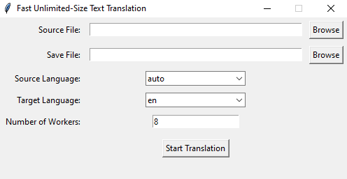

# Fast-Unlimited-Size-Text-Translation

## Brief

This application efficiently translates large text files using Google Translate. Developed in Python with a Tkinter GUI and leveraging the Deep Translator library, it overcomes Google Translate's 5000-character limit per translation. By breaking down text files into smaller chunks and employing multithreading for parallel translation, the tool accelerates the process. Users can specify source and target languages, initiate translations with a click, and monitor progress via a built-in progress bar.

## Snapshot



## Workflow Explanation

The workflow is straightforward:

1. User selects source file, defines source and target languages, and specifies save location through the GUI.
2. Upon clicking "Start Translation", the tool begins processing.

## Setup Instructions

### Using Python Virtual Environment

1. Create a Python virtual environment:
   ```bash
   python -m venv local
   ```
2. Install dependencies:
   ```bash
   .\local\Scripts\pip install deep-translator==1.11.4
   ```
3. Run the tool:
   ```bash
   .\local\Scripts\python main.py
   ```

### Using Executables

1. Download the pre-built executable from the releases section.
2. Double-click the executable to run the tool.

## Notes

- The application features a progress bar that appears during the translation process, offering visual feedback to the user.
- Users can adjust the maximum characters limit per chunk, with a default value of 3000, to avoid potential errors related to the Deep Translator library. If encountering errors, lowering the limit is recommended, though a maximum of 5000 characters per chunk can be selected.
